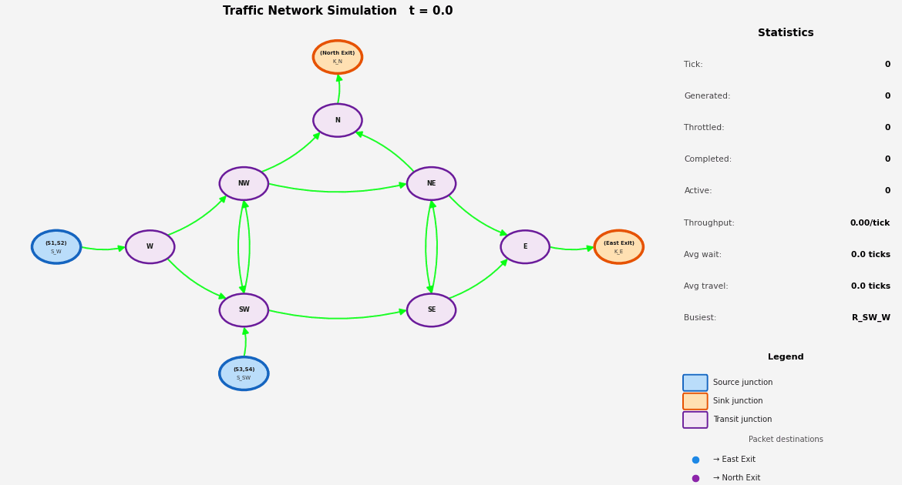

# Modular Network Traffic Simulator

A small modular traffic simulator for a directed road network with junctions,
sources, sinks, queueing, congestion-aware adaptive routing, basic statistics,
and animated GIF + PDF outputs.

Built for an educational networking-course assignment — roads = links,
junctions = routers, vehicles = packets — so the routing layer is the
interesting part.

---

## Features

- **Directed roads** with finite capacity and per-road travel time
- **Junctions** of any in/out degree (2-/3-/4-way and beyond), with
  round-robin scheduling across competing input buffers
- **Vehicles** with explicit source and destination
- **Traffic sources** in two modes:
  - `constant` — one vehicle every *N* ticks
  - `poisson` — Poisson process with rate λ vehicles/tick
- **Sinks** (cosmetic — the simulator completes a vehicle when its
  `current_node == destination`; sinks tag the junction in the visualizer)
- **Adaptive routing** — at every junction, each vehicle re-runs Dijkstra
  using `weight = travel_time × (1 + α × occupancy)`. Higher α makes routes
  react more strongly to current congestion. α = 0 falls back to plain
  shortest-travel-time routing.
- **Anti-oscillation** — vehicles refuse the immediate U-turn back to the
  junction they just came from (unless it is the only option)
- **Discrete time-step** engine, ordered so that every vehicle waits ≥ 1 tick
  in any queue it enters
- **GIF visualization** with destination-keyed vehicle colors, road
  congestion coloring (green → red), per-frame stats panel, and queued
  vehicles drawn at junctions
- **Statistics**: throughput, average wait, average travel time, average
  queue length, busiest road
- **Time-series PDF** — queue, throughput, wait-time distribution, and
  per-road occupancy over the full run

---

## Project structure

```text
modular-network-traffic-simulator/
├── main.py                 # network definition + entry point
├── network.json            # example: 5-junction network, single destination
├── network-2.json          # example: 7-junction network, two destinations
├── requirements.txt
├── docs/                   # sample outputs referenced from this README
│   └── network-2.gif
└── traffic_sim/            # the reusable library
    ├── __init__.py
    ├── vehicles.py
    ├── roads.py
    ├── junctions.py
    ├── sources.py
    ├── sinks.py
    ├── router.py           # Dijkstra
    ├── simulator.py        # core engine, adaptive routing, stats, PDF
    └── visualization.py    # matplotlib + networkx + imageio
```

---

## Installation

Requires **Python 3.10+** (uses PEP 604 `X | None` type syntax).

```bash
python3 -m venv venv
source venv/bin/activate
pip install -r requirements.txt
```

`requirements.txt` is just `matplotlib`, `networkx`, `imageio`, `Pillow`.

---

## Run

### Built-in demo network

```bash
python3 main.py
```

Defined in `build_demo_network()` inside `main.py` — a 5-junction layout
with three sources all routing to junction `E`.

### From a JSON network file

```bash
python3 main.py network.json
python3 main.py network-2.json
```

Each run writes three files into `output/`:

| File | Purpose |
|---|---|
| `output/simulation.gif` | animated playback of the run |
| `output/stats.json`     | summary statistics (one JSON object) |
| `output/stats.pdf`      | 2-page PDF: time-series charts + per-road occupancy |
| `output/frames/*.png`   | individual frames used to assemble the GIF |

---

## Network JSON schema

A network file has four top-level keys: `junctions`, `roads`, `sources`,
`sinks`.

```json
{
  "junctions": [
    {"name": "<id>", "pos": [<x>, <y>]}
  ],
  "roads": [
    {"name": "<id>", "from": "<junction>", "to": "<junction>",
     "capacity": <int>, "travel_time": <int>}
  ],
  "sources": [
    {"id": "<id>", "junction": "<junction>", "destination": "<junction>",
     "mode": "constant", "interval": <int>},
    {"id": "<id>", "junction": "<junction>", "destination": "<junction>",
     "mode": "poisson",  "rate": <float>}
  ],
  "sinks": ["<junction>", "<junction>"]
}
```

Notes:
- `pos` is the (x, y) position used to lay out the junction in the GIF.
  Unused if you don't care about layout (a spring layout is used as
  fallback), but providing positions makes the animation much easier to read.
- `capacity` is the maximum number of vehicles a road can hold at once.
  When a road is full, vehicles back up in the upstream junction's input buffer.
- `travel_time` is in ticks. A vehicle entering the road at tick *t* arrives
  at the destination junction at tick *t + travel_time*.
- `mode` is `"constant"` (uses `interval`) or `"poisson"` (uses `rate`).
- `sinks` is decorative — destinations are taken from each source's
  `destination` field. Listing them keeps the visualization legend honest.

---

## Sample run: `network-2.json`

A 7-junction network. Vehicles originate at `W` and `SW` and head for `N`
or `E`, so the simulator has to route across two destinations
simultaneously. Roads `R5/R6` (NW↔SW) and `R7/R8` (NE↔SE) are bottlenecks
(capacity = 1) — adaptive routing should largely route *around* them once
they fill up.

### Input

```json
{
  "junctions": [
    {"name": "W",  "pos": [0.0, 1.0]},
    {"name": "NW", "pos": [1.0, 2.0]},
    {"name": "SW", "pos": [1.0, 0.0]},
    {"name": "NE", "pos": [3.0, 2.0]},
    {"name": "SE", "pos": [3.0, 0.0]},
    {"name": "N",  "pos": [2.0, 3.0]},
    {"name": "E",  "pos": [4.0, 1.0]}
  ],
  "roads": [
    {"name": "R1",  "from": "W",  "to": "NW", "capacity": 2, "travel_time": 2},
    {"name": "R2",  "from": "W",  "to": "SW", "capacity": 2, "travel_time": 2},
    {"name": "R3",  "from": "NW", "to": "NE", "capacity": 3, "travel_time": 3},
    {"name": "R4",  "from": "SW", "to": "SE", "capacity": 3, "travel_time": 3},
    {"name": "R5",  "from": "NW", "to": "SW", "capacity": 1, "travel_time": 2},
    {"name": "R6",  "from": "SW", "to": "NW", "capacity": 1, "travel_time": 2},
    {"name": "R7",  "from": "NE", "to": "SE", "capacity": 1, "travel_time": 2},
    {"name": "R8",  "from": "SE", "to": "NE", "capacity": 1, "travel_time": 2},
    {"name": "R9",  "from": "NW", "to": "N",  "capacity": 2, "travel_time": 2},
    {"name": "R10", "from": "NE", "to": "N",  "capacity": 2, "travel_time": 2},
    {"name": "R11", "from": "NE", "to": "E",  "capacity": 2, "travel_time": 2},
    {"name": "R12", "from": "SE", "to": "E",  "capacity": 2, "travel_time": 2}
  ],
  "sources": [
    {"id": "S1", "junction": "W",  "destination": "N", "mode": "constant", "interval": 3},
    {"id": "S2", "junction": "W",  "destination": "E", "mode": "constant", "interval": 4},
    {"id": "S3", "junction": "SW", "destination": "N", "mode": "poisson",  "rate": 0.3},
    {"id": "S4", "junction": "SW", "destination": "E", "mode": "poisson",  "rate": 0.25}
  ],
  "sinks": ["N", "E"]
}
```

### Output



A typical 40-tick run on this network produces something like:

| Metric | Value |
|---|---|
| generated | 37 |
| completed | 30 |
| in-system at end | 11 |
| avg wait | 3.43 ticks |
| avg travel time | 6.13 ticks |
| throughput | 0.75 / tick |
| busiest road | R9 |

Exact numbers vary run to run because the Poisson sources are unseeded.

---

## Defining your own network

The cleanest path is to drop a new JSON file next to the existing ones and
run `python3 main.py mynet.json`. If you'd rather build it programmatically,
edit `build_demo_network()` in `main.py`:

```python
sim = TrafficSimulator(sim_time=60, output_dir="output", congestion_alpha=1.5)

sim.add_junction("A", pos=(0, 0))
sim.add_junction("B", pos=(1, 0))
sim.add_road("R1", "A", "B", capacity=2, travel_time=3)

sim.add_source(TrafficSource("S1", junction="A", destination="B",
                             mode="poisson", rate=0.4))
sim.add_sink(Sink("B"))

sim.run(make_gif=True, fps=4)
```

Nothing under `traffic_sim/` should need to change to support a new
topology — the assignment hint that "new network topologies can be created
by changing only `main.py`" is honored.

---

## Engine semantics

A single tick executes in this order:

1. **Junctions process their input buffers.** Wait time accrues for every
   queued vehicle. Then each junction makes one round-robin sweep across its
   input buffers; for each non-empty buffer the front vehicle either
   completes (if it's at its destination) or moves onto its next road if
   there's capacity.
2. **Roads advance.** Each vehicle's remaining travel time decrements; on
   arrival the vehicle is enqueued at the end junction.
3. **Sources fire.** Constant sources emit if `t mod interval == 0`;
   Poisson sources draw `Poisson(λ)` and emit that many. New vehicles land
   in the source-junction's source buffer.
4. **Sample stats** for the time-series PDF.

Consequences:

- A vehicle that arrives at junction *X* in step 2 can't leave *X* in the
  same tick — it sits in *X*'s queue until the next tick's step 1. This
  guarantees a minimum 1-tick junction crossing and makes wait-time
  accounting honest.
- A freshly spawned vehicle similarly waits ≥ 1 tick in its source buffer
  before entering the road.

---

## Adaptive routing

`shortest_path` is re-evaluated for each vehicle at each junction visit
using a per-tick weighted adjacency:

```
weight(road) = travel_time × (1 + α × len(vehicles) / capacity)
```

The weight cache is invalidated every tick, but is shared by all routing
decisions within the tick — a single Dijkstra per (vehicle, junction) is the
worst case. With < 10 junctions the cost is negligible.

`congestion_alpha` is a constructor argument on `TrafficSimulator` (default
`1.5`):

| α    | behavior                                                  |
|------|-----------------------------------------------------------|
| 0    | static shortest-travel-time routing                       |
| ~1   | mild preference for less-congested paths                  |
| ~2-3 | aggressive load balancing — vehicles split across paths   |

To prevent oscillation, when computing the next hop at junction *Y*, the
back-edge to the previous junction *X* is excluded from the local adjacency
unless removing it disconnects the destination.

---

## Simplifying assumptions

- Time-step simulation, not event-driven — the smallest meaningful time
  unit is one tick.
- One vehicle per input buffer per tick at any given junction (the
  round-robin pass touches each buffer once).
- No lane-level modeling, overtaking, or traffic-light phasing — junctions
  are pure round-robin schedulers.
- Source buffers are unbounded; vehicles never abandon their trip.
- All vehicles are identical (no speed, type, or priority differentiation).

---

## License

Educational use.
