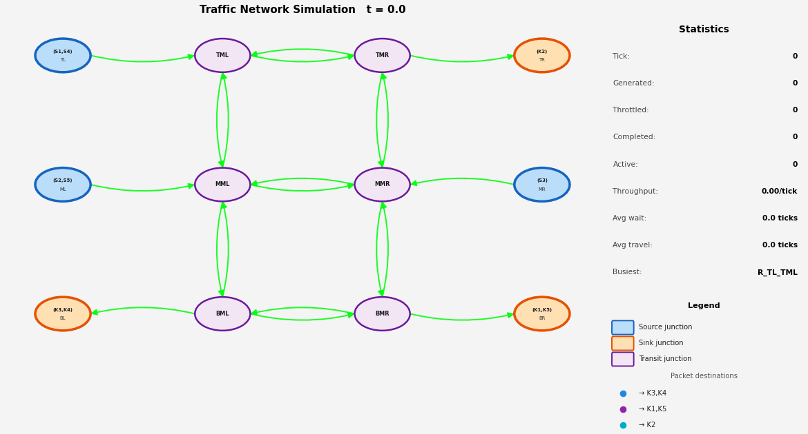

# Modular Network Traffic Simulator

A small modular traffic simulator for a directed road network with junctions,
sources, sinks, queueing, congestion-aware adaptive routing, basic statistics,
and animated GIF + PDF outputs.

Built for an educational networking-course assignment — roads = links,
junctions = routers, vehicles = packets — so the routing layer is the
interesting part.

---

## Features

- **Directed roads** with finite capacity and per-road travel time
- **Pipelined link model** — a road behaves like a network link: multiple
  packets can be in-flight simultaneously (one per tick slot), but they are
  strictly serialized — no two packets share the same position. Packets are
  always staggered by at least one tick, exactly as in store-and-forward
  pipelining.
- **Junctions** of any in/out degree (2-/3-/4-way and beyond), with
  round-robin scheduling across competing input buffers
- **Vehicles** with explicit source and destination
- **Traffic sources** in two modes:
  - `constant` — one vehicle every *N* ticks
  - `poisson` — Poisson process with rate λ vehicles/tick
- **Source/sink stub architecture** — sources and sinks are modeled as
  external stub nodes connected to the transit grid by one-way roads.
  Traffic cannot pass *through* a source or sink; sources only inject
  packets into the network and sinks only absorb them.
- **Sinks** complete a vehicle when its `current_node == destination`
- **Adaptive routing** — at every junction, each vehicle re-runs Dijkstra
  using `weight = travel_time × (1 + α × occupancy)`. Higher α makes routes
  react more strongly to current congestion. α = 0 falls back to plain
  shortest-travel-time routing.
- **Anti-oscillation** — vehicles refuse the immediate U-turn back to the
  junction they just came from (unless it is the only option)
- **Discrete time-step** engine, ordered so that every vehicle waits ≥ 1 tick
  in any queue it enters
- **GIF visualization** with:
  - Destination-keyed packet colors (chosen to be distinct from road
    congestion colors)
  - Road congestion coloring (green → red), drawn as `FancyArrowPatch` arcs
    so packet positions are pixel-accurate on the arc
  - Per-frame stats panel (statistics + legend, replacing road occupancy bars
    since congestion is already visible on the roads themselves)
  - Queued packets drawn as colored squares in a ring around each junction
  - Node labels inside circles — source/sink nodes show their ID in
    parentheses `(S1,S4)` plus the junction short-name; transit nodes show
    only the short-name
  - Dynamic source/sink node coloring — derived at runtime from the network
    definition, works for any topology
- **Statistics**: throughput, average wait, average travel time, average
  queue length, busiest road
- **Time-series PDF** — queue, throughput, wait-time distribution, and
  per-road occupancy over the full run

---

## Project structure

```text
modular-network-traffic-simulator/
├── main.py                 # network loader + entry point
├── network.json            # example: 5-junction network, single destination
├── network-2.json          # example: 7-junction network, two destinations
├── test.json               # professor 3×3 grid (4-column topology)
├── requirements.txt
├── docs/                   # sample outputs referenced from this README
│   └── network-2.gif
│   └── test.gif
└── traffic_sim/            # the reusable library
    ├── __init__.py
    ├── vehicles.py
    ├── roads.py            # pipelined link model
    ├── junctions.py
    ├── sources.py
    ├── sinks.py
    ├── router.py           # Dijkstra
    ├── simulator.py        # core engine, adaptive routing, stats, PDF
    └── visualization.py    # matplotlib + networkx + imageio
```

---

## Installation

Requires **Python 3.10+** (uses PEP 604 `X | None` type syntax).

```bash
python3 -m venv venv
source venv/bin/activate
pip install -r requirements.txt
```

`requirements.txt` is just `matplotlib`, `networkx`, `imageio`, `Pillow`.

---

## Run

### Built-in demo network

```bash
python3 main.py
```

Defined in `build_demo_network()` inside `main.py` — a 5-junction layout
with three sources all routing to junction `E`.

### From a JSON network file

```bash
python3 main.py network.json
python3 main.py network-2.json
python3 main.py test.json
```

Each run writes three files into `output/`:

| File | Purpose |
|---|---|
| `output/simulation.gif` | animated playback of the run |
| `output/stats.json`     | summary statistics (one JSON object) |
| `output/stats.pdf`      | 2-page PDF: time-series charts + per-road occupancy |
| `output/frames/*.png`   | individual frames used to assemble the GIF |

---

## Network JSON schema

A network file has four required top-level keys and one optional key:
`junctions`, `roads`, `sources`, `sinks`, and `labels`.

```json
{
  "junctions": [
    {"name": "<id>", "pos": [<x>, <y>]}
  ],
  "roads": [
    {"name": "<id>", "from": "<junction>", "to": "<junction>",
     "capacity": <int>, "travel_time": <int>}
  ],
  "sources": [
    {"id": "<id>", "junction": "<junction>", "destination": "<junction>",
     "mode": "constant", "interval": <int>},
    {"id": "<id>", "junction": "<junction>", "destination": "<junction>",
     "mode": "poisson",  "rate": <float>}
  ],
  "sinks": ["<junction>", "<junction>"],
  "labels": {
    "<junction>": "<display name>"
  }
}
```

Notes:
- `pos` is the (x, y) position used to lay out the junction in the GIF.
  Unused if you don't care about layout (a spring layout is used as
  fallback), but providing positions makes the animation much easier to read.
- `capacity` is the maximum number of packets a road can hold in-flight at
  once (pipeline depth). When a road is full, packets back up in the upstream
  junction's input buffer.
- `travel_time` is in ticks. A packet entering the road at tick *t* arrives
  at the destination junction at tick *t + travel_time*. The road is
  pipelined — each tick slot holds at most one packet, so a road of capacity
  *k* and travel time *k* is always exactly full when saturated.
- `mode` is `"constant"` (uses `interval`) or `"poisson"` (uses `rate`).
- `sinks` is a list of junction names that act as traffic exits. A sink
  junction should have no outgoing roads — it is a dead-end terminal.
- `labels` is optional. Use it to give a human-readable display name to any
  junction in the visualization — most useful for sink stubs where you want
  to show `K1,K5` instead of a raw junction ID like `J_BR`. Source junction
  labels are set automatically from the source IDs defined in `sources`.

### Source/sink stub pattern

The recommended way to model entry and exit points is to use **external stub
nodes** connected to the transit grid by a single one-way road:

```
[S_A] ──► [A] ──► [B] ──► ... ──► [E] ──► [K_E]
 source stub        transit grid        sink stub
```

- Source stubs have one outbound road into the grid and no inbound roads.
  Traffic originates here and immediately flows inward.
- Sink stubs have one inbound road from the grid and no outbound roads.
  Traffic terminates here.
- This ensures no packet can route *through* a source or sink — they are
  strictly inject/absorb endpoints.

See `network.json`, `network-2.json`, and `test.json` for worked examples.

---

## Sample run: `network-2.json`

A 7-junction network with source/sink stubs. Vehicles originate at `S_W`
and `S_SW` and head for `K_N` or `K_E`, so the simulator has to route
across two destinations simultaneously. Roads `R5/R6` (NW↔SW) and `R7/R8`
(NE↔SE) are bottlenecks (capacity = 1) — adaptive routing should largely
route *around* them once they fill up.

### Output


A typical 40-tick run on this network produces something like:

| Metric | Value |
|---|---|
| generated | 37 |
| completed | 30 |
| in-system at end | 11 |
| avg wait | 3.43 ticks |
| avg travel time | 6.13 ticks |
| throughput | 0.75 / tick |
| busiest road | R9 |

Exact numbers vary run to run because the Poisson sources are unseeded.

---

## Test Network



---

## Defining your own network

The cleanest path is to drop a new JSON file next to the existing ones and
run `python3 main.py mynet.json`. Follow the source/sink stub pattern above
so the visualization colors and routing behave correctly.

If you'd rather build it programmatically, edit `build_demo_network()` in
`main.py`:

```python
sim = TrafficSimulator(sim_time=60, output_dir="output", congestion_alpha=1.5)

sim.add_junction("S_A", pos=(0, 0))   # source stub
sim.add_junction("A",   pos=(1, 0))   # transit
sim.add_junction("B",   pos=(2, 0))   # transit
sim.add_junction("K_B", pos=(3, 0))   # sink stub

sim.add_road("R_SA_A", "S_A", "A",   capacity=2, travel_time=2)
sim.add_road("R1",     "A",   "B",   capacity=2, travel_time=3)
sim.add_road("R_B_KB", "B",   "K_B", capacity=2, travel_time=2)

sim.add_source(TrafficSource("S1", junction="S_A", destination="K_B",
                             mode="poisson", rate=0.4))
sim.add_sink(Sink("K_B"))
sim.junction_labels["K_B"] = "K_B"

sim.run(make_gif=True, fps=4)
```

Nothing under `traffic_sim/` should need to change to support a new
topology.

---

## Engine semantics

A single tick executes in this order:

1. **Junctions process their input buffers.** Wait time accrues for every
   queued vehicle. Then each junction makes one round-robin sweep across its
   input buffers; for each non-empty buffer the front vehicle either
   completes (if it's at its destination) or moves onto its next road if
   there's capacity.
2. **Roads advance.** Each vehicle's remaining travel time decrements; on
   arrival the vehicle is enqueued at the end junction.
3. **Sources fire.** Constant sources emit if `t mod interval == 0`;
   Poisson sources draw `Poisson(λ)` and emit that many. New vehicles land
   in the source-junction's source buffer.
4. **Sample stats** for the time-series PDF.

Consequences:

- A vehicle that arrives at junction *X* in step 2 can't leave *X* in the
  same tick — it sits in *X*'s queue until the next tick's step 1. This
  guarantees a minimum 1-tick junction crossing and makes wait-time
  accounting honest.
- A freshly spawned vehicle similarly waits ≥ 1 tick in its source buffer
  before entering the road.

---

## Pipelined link model

Roads model network links with pipelining, not parallel transmission:

```
Tick 1: [P1 enters]  P1 at position 1/4
Tick 2: [P2 enters]  P1 at 2/4 · P2 at 1/4
Tick 3: [P3 enters]  P1 at 3/4 · P2 at 2/4 · P3 at 1/4
Tick 4: [P4 enters]  P1 exits  · P2 at 3/4 · P3 at 2/4 · P4 at 1/4
```

A new packet can enter the road every tick as long as:
1. The road is not at capacity (`len(vehicles) < capacity`), and
2. No packet entered on the current tick (the tail slot is free).

Condition 2 enforces serialization — no two packets ever share the same
position on the link. `capacity` represents the pipeline depth (how many
packets can be simultaneously in-flight), not a parallel-channel count.

---

## Adaptive routing

`shortest_path` is re-evaluated for each vehicle at each junction visit
using a per-tick weighted adjacency:

```
weight(road) = travel_time × (1 + α × len(vehicles) / capacity)
```

The weight cache is invalidated every tick, but is shared by all routing
decisions within the tick — a single Dijkstra per (vehicle, junction) is the
worst case. With < 10 junctions the cost is negligible.

`congestion_alpha` is a constructor argument on `TrafficSimulator` (default
`1.5`):

| α    | behavior                                                  |
|------|-----------------------------------------------------------|
| 0    | static shortest-travel-time routing                       |
| ~1   | mild preference for less-congested paths                  |
| ~2-3 | aggressive load balancing — vehicles split across paths   |

To prevent oscillation, when computing the next hop at junction *Y*, the
back-edge to the previous junction *X* is excluded from the local adjacency
unless removing it disconnects the destination.

---

## Simplifying assumptions

- Time-step simulation, not event-driven — the smallest meaningful time
  unit is one tick.
- One vehicle per input buffer per tick at any given junction (the
  round-robin pass touches each buffer once).
- No lane-level modeling, overtaking, or traffic-light phasing — junctions
  are pure round-robin schedulers.
- Source buffers are unbounded; vehicles never abandon their trip.
- All vehicles are identical (no speed, type, or priority differentiation).

---

## License

Educational use.
